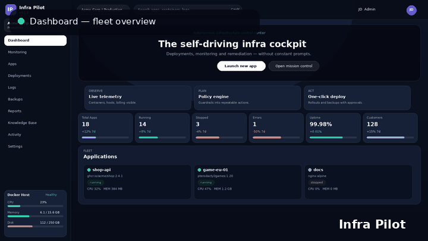
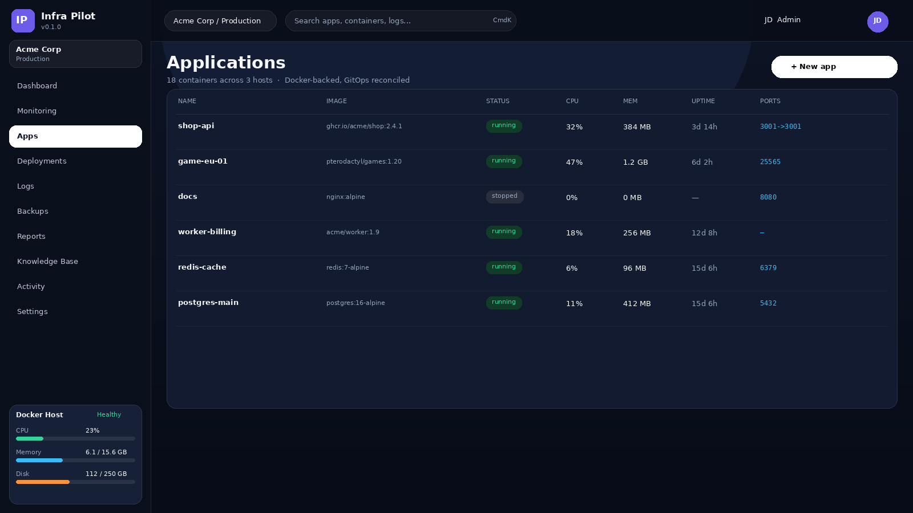
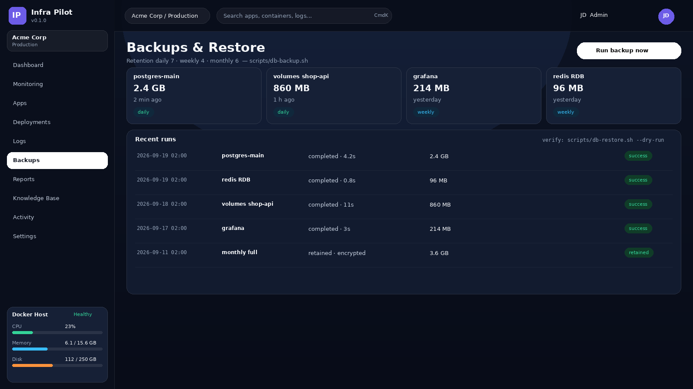
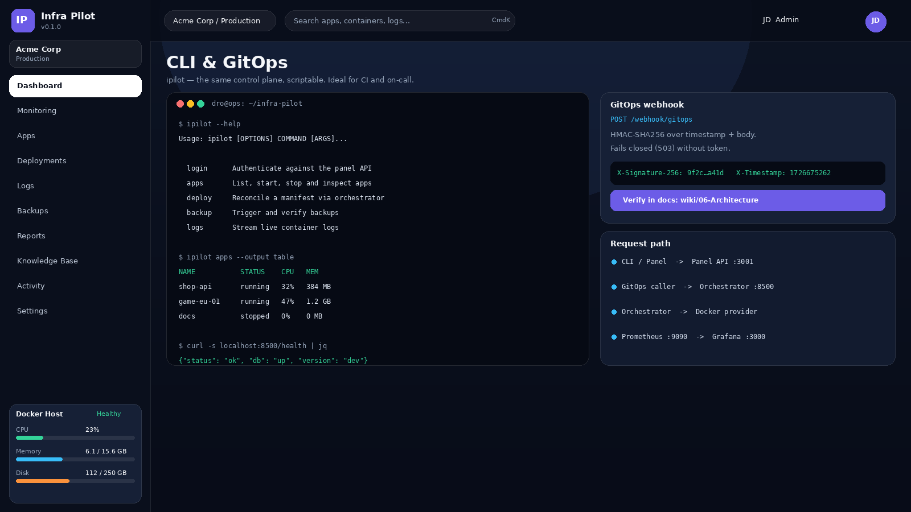
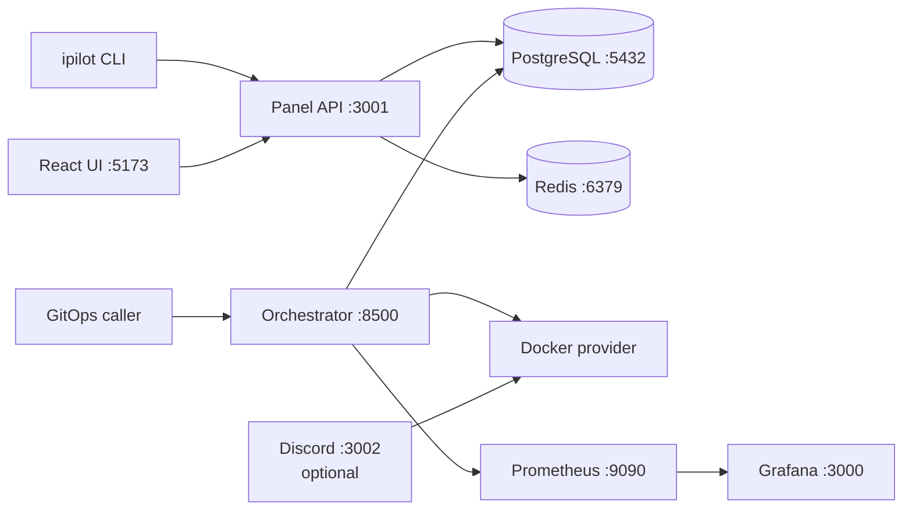

# Infra Pilot

[](https://github.com/drosemann/infra-pilot/actions/workflows/ci.yml)
[](https://www.python.org)
[](https://nodejs.org)
[](./docker-compose.yml)
[](./LICENSE)

> Docker-native infrastructure control plane: a React/Express
> management panel, a Python orchestrator agent with GitOps
> reconciliation, a Typer-based `ipilot` CLI, and optional
> Discord and monitoring profiles.

Infra Pilot manages your own VPS and container fleet — deployments,
monitoring, backups, and remediation — without a heavyweight PaaS.
It is an internal operations tool, not a public hosting platform.

---

## Table of contents

- [What you get](#what-you-get)
- [Screenshots](#screenshots)
- [Architecture](#architecture)
- [Quickstart](#quickstart)
- [Configuration](#configuration)
- [Usage](#usage)
- [API reference](#api-reference)
- [Deployment](#deployment)
- [Observability](#observability)
- [Backup and restore](#backup-and-restore)
- [Security](#security)
- [Testing and quality gates](#testing-and-quality-gates)
- [Project structure](#project-structure)
- [Documentation map](#documentation-map)
- [Contributing](#contributing)
- [Support](#support)
- [Roadmap](#roadmap)
- [License](#license)

---

## What you get

| Capability | Where | Notes |
| --- | --- | --- |
| Container fleet UI | Management panel `:5173` | Apps, logs, metrics, terminals |
| Panel API + Swagger | Management panel `:3001` | `/api/openapi.json`, `/api/docs` |
| GitOps reconciliation | Orchestrator `:8500` | Signed webhooks, manifests |
| Scriptable operations | `ipilot` CLI | Same control plane as the UI |
| Metrics stack | `monitoring` profile | Prometheus `:9090`, Grafana `:3000` |
| ChatOps integration | `discord` profile | Discord service `:3002` |

Core principles:

- **Docker-native.** No hidden schedulers. Compose for local,
  Helm for Kubernetes.
- **API-first.** Every UI action maps to a documented API call
  or CLI command.
- **Secure by default.** Signed webhooks, bearer-token federation,
  fail-closed auth, secret scanning in CI.
- **Observable.** Health, readiness, metrics, and structured logs
  on every service.

Non-goals: public multi-tenant hosting, abuse handling, and
billing for third parties. Infra Pilot operates infrastructure
you already own.

---

## Screenshots

> Status: conceptual preview. The images below are mockups with demo
> data, faithful to the current `services/management-panel`
> implementation — illustrations, not captures of a running release.
> They will be replaced by real captures plus a CI smoke test; see
> [docs/screenshots](./docs/screenshots) for the capture log and
> regeneration instructions.



| Dashboard | Monitoring |
| --- | --- |
|  |  |
| Fleet overview, key metrics, and launch actions. | Throughput, health checks, and live logs. |

| Applications | Backups and restore |
| --- | --- |
|  |  |
| Status, resources, uptime, and ports per app. | Retention policy and recent runs. |

| CLI and GitOps |
| --- |
|  |
| `ipilot`, signed webhooks, and the request path. |

---

## Architecture



| Service | Implementation | Default endpoint | Profile |
| --- | --- | --- | --- |
| Management panel | React + Express + WebSocket | UI `:5173`, API `:3001` | default |
| Orchestrator agent | Python + aiohttp | `:8500` | default |
| PostgreSQL / Redis | Docker images | `:5432` / `:6379` | default |
| Discord service | Node.js | `:3002` | `discord` |
| Prometheus / Grafana | Docker images | `:9090` / `:3000` | `monitoring` |
| k6 load runner | `grafana/k6` | one-shot job | `loadtest` |

Details: [wiki/06-Architecture](./wiki/06-Architecture.md),
[docs/ARCHITECTURE](./docs/ARCHITECTURE.md).

---

## Quickstart

### Prerequisites

| Tool | Needed for | Check |
| --- | --- | --- |
| Docker Engine + Compose v2 | Full local stack | `docker compose version` |
| Python 3.10+ | CLI, orchestrator dev | `python3 --version` |
| Node.js 22+ and npm | Panel dev | `node --version` |

### Full local stack (recommended)

```bash
git clone https://github.com/drosemann/infra-pilot.git
cd infra-pilot
cp .env.example .env
bash scripts/generate-env.sh
docker compose up -d
```

Then open:

- Panel UI: `http://localhost:5173`
- Panel Swagger: `http://localhost:3001/api/docs`
- Orchestrator health: `http://localhost:8500/health`

Verify:

```bash
docker compose ps
docker compose logs -f management-panel orchestrator-agent
```

### Optional profiles

```bash
# Metrics and dashboards
docker compose --profile monitoring up -d

# Discord and Pterodactyl integration
docker compose --profile discord up -d

# Load-test scenarios (smoke, soak, spike)
make load-smoke
```

### CLI only

```bash
pip install ./cli
ipilot --help
ipilot login <api-key>
```

For editable installs: `pip install -e ./cli`.
Full guide: [wiki/01-Installation](./wiki/01-Installation.md).

### Update and stop

```bash
git pull
docker compose up -d --build
docker compose down
```

`down` keeps named volumes. Use `down -v` only when you intend
to delete local database and metrics data.

---

## Configuration

Copy `.env.example` to `.env`. Never commit `.env`.
Run `bash scripts/generate-env.sh` to fill empty secrets.

| Group | Key variables | Required |
| --- | --- | --- |
| Database | `POSTGRES_USER`, `POSTGRES_PASSWORD`, `POSTGRES_DB` | Yes |
| Orchestrator auth | `GITOPS_WEBHOOK_TOKEN`, `FEDERATION_API_TOKEN` | Yes |
| Panel exposure | `MANAGEMENT_FRONTEND_PORT`, `MANAGEMENT_BACKEND_PORT`, `CORS_ORIGINS` | No |
| GitHub webhook | `GITHUB_WEBHOOK_SECRET` | If used |
| Monitoring | `PROMETHEUS_PORT`, `GRAFANA_PORT`, `K6_*` | If used |
| Discord | `DISCORD_TOKEN`, `PTERODACTYL_API_KEY` | If used |

CLI precedence: built-in defaults, then `~/.ipilot/config.json`,
then named profile file, then `IPILOT_API_URL`, `IPILOT_TOKEN`,
and `IPILOT_OUTPUT` environment variables.

Details: [wiki/03-Configuration](./wiki/03-Configuration.md),
[`.env.example`](./.env.example).

---

## Usage

### Panel workflow

1. Open `http://localhost:5173` and complete the setup flow.
2. Create an app from the dashboard.
3. Inspect logs, terminal, metrics, and backups from the app
   detail view.
4. Manage configuration, alerts, and maintenance windows from
   settings.

### CLI workflow

```bash
export IPILOT_API_URL=http://localhost:3001
ipilot login <your-api-key>

ipilot server create my-first-server --image nginx:latest --memory 2048
ipilot server status <server-id>
ipilot server start <server-id>
ipilot logs fetch <server-id> --lines 50
ipilot server delete <server-id>
```

More examples: [wiki/04-Usage-Examples](./wiki/04-Usage-Examples.md),
[wiki/05-CLI-Reference](./wiki/05-CLI-Reference.md).

### GitOps webhook

```bash
TS=$(date +%s)
BODY='{"manifest": "apps/shop-api.yml"}'
SIG=$(printf "%s%s" "$TS" "$BODY" \
  | openssl dgst -sha256 -hmac "$GITOPS_WEBHOOK_TOKEN" | cut -d' ' -f2)

curl -s http://localhost:8500/webhook/gitops \
  -H "Content-Type: application/json" \
  -H "X-Timestamp: $TS" \
  -H "X-Signature-256: $SIG" \
  -d "$BODY"
```

Unauthenticated or replayed calls are rejected. Missing server-side
tokens fail closed with `503`.

---

## API reference

Generated contracts take precedence over prose:

- Panel: `GET /api/openapi.json`, Swagger at `/api/docs`
- Orchestrator: `services/orchestrator-agent/api_docs/openapi.yaml`
- CLI: `ipilot --help`, `ipilot <group> --help`

| Surface | Auth | Purpose |
| --- | --- | --- |
| `GET /health`, `GET /api/health` | Public | Liveness, no DB |
| `GET /ready`, `GET /api/ready` | Public | Readiness, DB check |
| `GET /metrics` | Network-restricted | Prometheus scraping |
| `POST /webhook/gitops` | HMAC signature | Manifest reconciliation |
| `/api/*` (panel operational) | Panel session | App and ops management |
| `/api/*` (orchestrator) | Bearer token | Federation, RBAC, deploy |

Auth matrix: [wiki/11-Auth-Matrix](./wiki/11-Auth-Matrix.md).

---

## Deployment

### Docker Compose

The default profile runs PostgreSQL, Redis, panel, and
orchestrator. Add `--profile monitoring` or `--profile discord`
for optional services. All services define resource limits,
health checks, and `unless-stopped` restart policies.

### Helm

```bash
helm lint helm/infra-pilot
helm template helm/infra-pilot -f helm/infra-pilot/values.yaml
```

Chart sources: [helm/infra-pilot](./helm/infra-pilot).
Require real secrets via your release pipeline; fail fast on
placeholders.

### Terraform

Base modules live in [infra/terraform](./infra/terraform).
Review variables before applying to a real environment.

---

## Observability

- Orchestrator exposes `/health`, `/ready`, and `/metrics`.
- Panel exposes `/health` and `/api/health` for Compose probes.
- Prometheus scrapes configured targets; Grafana ships with a
  provisioned Prometheus datasource and dashboards.
- Panel monitoring page streams live logs and resource views.

Config: [infra/monitoring](./infra/monitoring).
Runbook: [wiki/10-Troubleshooting](./wiki/10-Troubleshooting.md).

---

## Backup and restore

```bash
bash scripts/db-backup.sh
bash scripts/db-restore.sh
```

- Default retention: daily 7, weekly 4, monthly 6.
- Verify restores with `--dry-run` before production use.
- Store off-host copies outside Docker named volumes.

Details: [wiki/12-Backup-Restore](./wiki/12-Backup-Restore.md).

---

## Security

Summary only. The binding policy is [SECURITY](./SECURITY.md).

- Secrets in environment, never in code. Gitleaks scans history.
- Orchestrator refuses placeholder secrets in production.
- New HTTP endpoints require HMAC, bearer, or RBAC. No open
 -by-default routes.
- Container spawns forbid `--privileged`, `--cap-add=ALL`,
  shell interpolation, and uncapped resources.
- Docker socket mounts are trusted-dev only. Use an allowlisted
  socket proxy in production.
- Report vulnerabilities privately. See [SECURITY](./SECURITY.md)
  for scope and response times.

---

## Testing and quality gates

```bash
pytest tests/ -q
bash scripts/test.sh --coverage
cd services/management-panel && npm run lint && npm run test:coverage
```

CI enforces gitleaks, flake8/black/isort, pytest with coverage
gates, shellcheck, terraform validate, markdownlint, and npm audit.
See [.github/workflows/ci.yml](./.github/workflows/ci.yml).

---

## Project structure

```text
cli/                      ipilot Typer CLI
services/management-panel React UI + Express API + WebSocket
services/orchestrator-agent Python agent, manifests, RBAC, webhooks
services/discord-service  Optional Discord and Pterodactyl bridge
helm/infra-pilot          Kubernetes chart
infra/monitoring          Prometheus and Grafana provisioning
infra/terraform           Base infrastructure modules
scripts/                  Env, backup, health, release helpers
tests/                    Python test suites and k6 scenarios
docs/                     Contributor docs and screenshots
wiki/                     User manual (installation to backup)
```

Service guides:

- [cli/README](./cli/README.md)
- [management-panel README](./services/management-panel/README.md)
- [orchestrator-agent README](./services/orchestrator-agent/README.md)
- [discord-service README](./services/discord-service/README.md)

---

## Documentation map

| Audience | Start here |
| --- | --- |
| New users | [wiki/Home](./wiki/Home.md), [wiki/01-Installation](./wiki/01-Installation.md) |
| Operators | [wiki/03-Configuration](./wiki/03-Configuration.md), [wiki/12-Backup-Restore](./wiki/12-Backup-Restore.md) |
| Developers | [docs/DOCUMENTATION](./docs/DOCUMENTATION.md), [docs/ARCHITECTURE](./docs/ARCHITECTURE.md) |
| API consumers | Panel `/api/docs`, orchestrator `api_docs/openapi.yaml` |
| Security reviewers | [SECURITY](./SECURITY.md), [wiki/08-Security](./wiki/08-Security.md) |

---

## Contributing

We welcome bug fixes, features, docs, and ideas.
Please read [CONTRIBUTING](./CONTRIBUTING.md) and the
[Code of Conduct](./CODE_OF_CONDUCT.md) first.

Branch prefixes: `feat/`, `fix/`, `docs/`, `refactor/`, `test/`,
`chore/`, `perf/`, `style/`.
Commit format: `<type>(<scope>): <short description>`.

This repository uses a deploy-key push flow documented in
[AGENTS](./AGENTS.md). Maintainers open pull requests from pushed
branches.

---

## Support

- Issues: use the bug report and feature request templates.
- Docs: check [FAQ](./wiki/09-FAQ.md) and
  [Troubleshooting](./wiki/10-Troubleshooting.md) first.
- Security: do not file public issues. See [SUPPORT](./SUPPORT.md)
  and [SECURITY](./SECURITY.md).

---

## Roadmap

- [ ] Tagged `1.0` release with stability guarantees
- [ ] Production Helm values and upgrade notes
- [ ] Expanded RBAC delegation and audit exports
- [ ] Panel e2e screenshot regeneration in CI
- [ ] Signed artifacts and SBOM publishing

---

## License

MIT. See [LICENSE](./LICENSE).

Started as `dmh-hosting` in March 2025, evolved into `infra-pilot`
as an internal tool for lean VPS and game-server operations.
Built during FISI training; maintained as a learning project with
production-grade hygiene.
