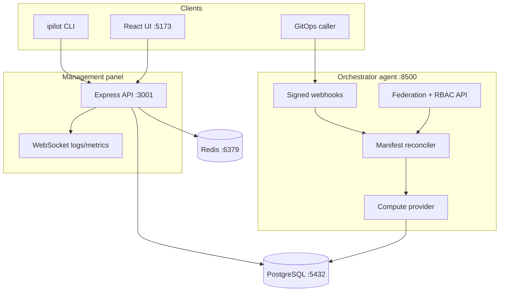

# Architecture

This is the contributor-level companion to
[wiki/06-Architecture](../wiki/06-Architecture.md).
The wiki describes runtime behavior. This file records
boundaries, invariants, and change rules.

---

## Topology

Optional services attach at the edges: Discord on the Docker
and Pterodactyl boundary, Prometheus/Grafana on `/metrics`.

---

## Service boundaries

| Service | Owns | Must not |
| --- | --- | --- |
| Management panel | UI, panel auth, app lifecycle UX | Talk to Docker directly from browser |
| Orchestrator | Manifests, providers, RBAC, webhooks | Trust unsigned callers |
| Discord service | ChatOps workflows | Bypass RBAC or container guards |
| PostgreSQL | Durable state | Accept internet traffic |
| Redis | Cache and ephemeral coordination | Store secrets unencrypted |

---

## Invariants

1. Panel operational `/api/*` routes require authentication.
2. Orchestrator `/api/*` fails closed without
   `FEDERATION_API_TOKEN`.
3. GitOps webhooks require HMAC plus timestamp replay checks.
4. Health and metrics stay unauthenticated for probes, but
   must not leak secrets. Restrict at the network layer.
5. Container spawns forbid privileged mode, shell
   interpolation, and missing resource limits.
6. Generated contracts win over prose: panel
   `/api/openapi.json`, orchestrator `api_docs/openapi.yaml`,
   CLI `ipilot --help`.

---

## Change rules

- New Compose ports require updates to `README.md`,
  `wiki/01-Installation.md`, and `wiki/03-Configuration.md`.
- New panel routes require OpenAPI plus Swagger visibility.
- New orchestrator routes require `api_docs/openapi.yaml`
  plus a contract test.
- New CLI groups require `cli/README.md` and
  `wiki/05-CLI-Reference.md` updates.
- Trust-boundary changes require a `SECURITY.md` update.

See [DOCUMENTATION](./DOCUMENTATION.md) for the 25-line rule.
