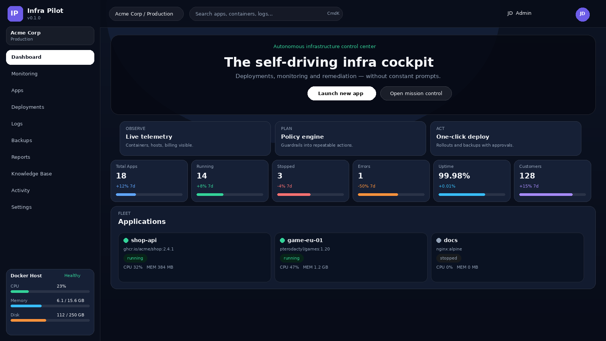
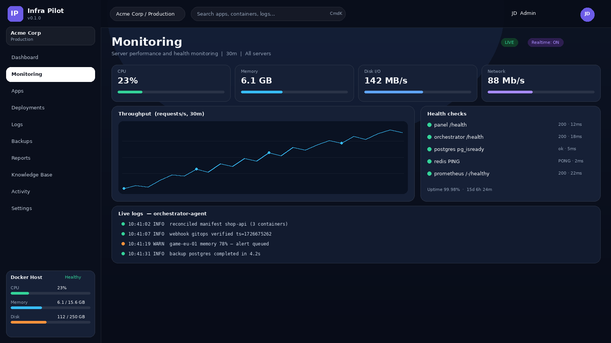

# Management Panel

React/TypeScript frontend and Express/WebSocket backend for operating Docker
applications, backups, configuration, monitoring, and the panel-facing Infra
Pilot API.

## Screenshots

Conceptual UI previews with demo data (see `docs/screenshots/`).
Illustrations of the intended UI, not captures of a running release:




Full set: dashboard, monitoring, applications, backups, and CLI/GitOps,
plus an animated `tour.gif`. Regeneration instructions live in
`docs/screenshots/README.md`.

## Start locally

```bash
cd services/management-panel
cp .env.example .env.local
npm install
npm run dev
```

`npm run dev` starts Vite on `http://localhost:5173` and the backend on `http://localhost:3001`. The first visit uses the setup flow. For the complete dependency stack, start the repository root with `docker compose up -d` instead.

## API and authentication

| Surface | URL | Notes |
|---|---|---|
| Health | `GET /health`, `GET /api/health` | Used by Compose health checks. |
| OpenAPI | `GET /api/openapi.json` | Current panel API contract. |
| Swagger UI | `GET /api/docs` | Interactive API documentation. |
| WebSocket | `ws://host:3001?appId=<id>` | Live application logs and metrics. |

Setup, health, and documentation endpoints are intentionally reachable without
an application session. Operational `/api/*` routes are protected by the
backend's `verifyAuth` middleware unless explicitly documented otherwise.
Treat the OpenAPI document and `server/index.ts` as the authoritative
route list.

## Configuration

Copy `.env.example` to `.env.local` for standalone development. The root `.env.example` controls Compose deployments.

| Variable | Purpose |
|---|---|
| `PORT` | Backend listener (default `3001`). |
| `VITE_API_URL`, `VITE_ENVIRONMENT` | Frontend API target and environment label. |
| `DATABASE_URL`, `REDIS_URL` | Backend service connections. |
| `CORS_ORIGINS` | Comma-separated permitted browser origins. |
| `VITE_SUPABASE_URL`, `VITE_SUPABASE_ANON_KEY` | Optional hosted-feature configuration. |

## Code map

| Path | Responsibility |
|---|---|
| `src/` | React UI, routes, components, hooks, and browser API clients. |
| `server/index.ts` | Express routes, authentication, WebSocket integration, and service startup. |
| `server/openapi.ts` | Panel OpenAPI specification. |
| `server/*.ts` | Focused backend helpers such as reports, GraphQL, assistant, doctor, and audit sanitisation. |
| `docs/` | Longer-lived design and setup notes. |

## Development checks

```bash
npm run lint
npm test
npm run build
```

The project also contains Playwright and accessibility tests; see `package.json` and `tests/` for the exact commands.

## Docker integration

The panel invokes Docker operations for application lifecycle actions, logs,
stats, and terminal-related features. Give Docker access only to trusted
deployments, because the Docker socket is privileged.
