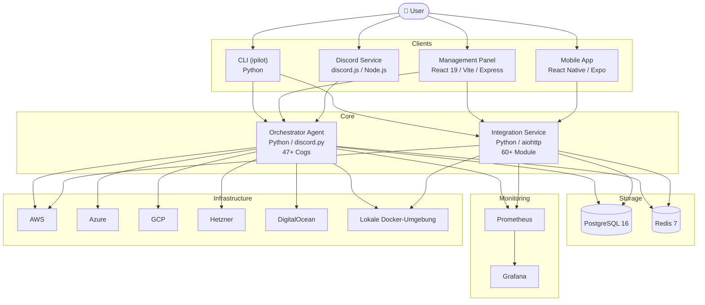

# 06 – Architecture

## Systemüberblick

Infra-Pilot ist eine modulare Microservice-Architektur. Jeder Service hat eine klar definierte Verantwortung.



## Komponenten im Detail

| Service | Sprache | Port | Aufgabe |
|---------|---------|------|---------|
| **Management Panel** | TypeScript/React/Express | 5173 (FE), 3001 (API) | Dashboard, Server-Verwaltung, Echtzeit-Metriken |
| **Orchestrator Agent** | Python (discord.py) | 8500 | Provisionierung, Discord-Befehle, 47+ Cogs |
| **Integration Service** | Python (aiohttp) | 9000 | Externe APIs, Webhook-Verarbeitung, 60+ Module |
| **Discord Service** | Node.js (discord.js) | 3002 | Discord-Bot, Slash-Commands, Benachrichtigungen |
| **CLI (ipilot)** | Python (stdlib only) | – | Terminal-Interface für 200+ Befehle |

## Datenfluss – Wo verlassen Daten die Maschine?

### Daten, die an externe LLM-APIs gehen

Wenn du die AI-Features nutzt (AI Assistant, AI Capacity Forecaster, AI Log Anomaly Detector):

| Daten | Geht zu | Konfigurierbar? |
|-------|---------|-----------------|
| Server-Metadaten (Typ, Status, Auslastung) | OpenAI API (`AI_API_ENDPOINT`) | Ja – eigener Endpunkt/modell |
| Log-Auszüge (für Anomalie-Erkennung) | OpenAI API | Ja – kann deaktiviert werden |
| Infrastruktur-Konfiguration (für Optimierung) | OpenAI API | Ja – lokales Modell möglich |
| Metriken/Zeitreihen (für Prognosen) | OpenAI API | Ja – kann deaktiviert werden |

### Lokaler LLM-Modus

Setze in der `.env`:

```env
AI_API_ENDPOINT=http://localhost:1234/v1
AI_MODEL=llama3-8b
```

Dann laufen **alle** AI-Operationen lokal – keine Daten verlassen die Maschine. Kompatibel mit Ollama, LM Studio, llama.cpp und anderen lokalen Inference-Servern.

### Externe Cloud-Provider

Wenn du Cloud-Ressourcen provisionierst (AWS, Azure, GCP, Hetzner), sendet der Orchestrator Agent API-Requests an die jeweiligen Cloud-Provider-Endpunkte. Das ist notwendig für die Ressourcen-Erstellung und -Verwaltung.

## Kommunikationsprotokolle

| Von | Zu | Protokoll | Format |
|-----|-----|-----------|--------|
| Dashboard | Orchestrator | REST | JSON |
| CLI | Management API | REST (`/api/v1/*`) | JSON |
| Discord Service | Orchestrator | REST | JSON |
| Orchestrator | Cloud APIs | REST/Provider-SDK | – |
| Dashboard | Browser | WebSocket | JSON (Live-Logs, Metriken) |

---

*Stand: Mai 2026 · Siehe auch [08-Security](08-Security) für Datenschutz-Details.*
